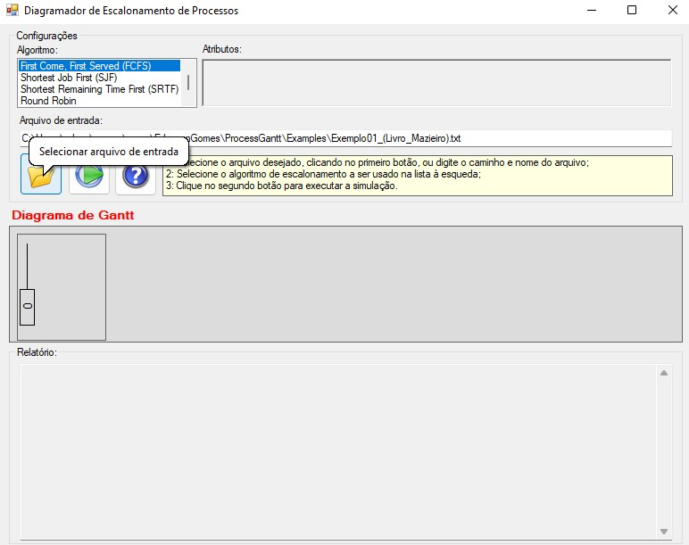
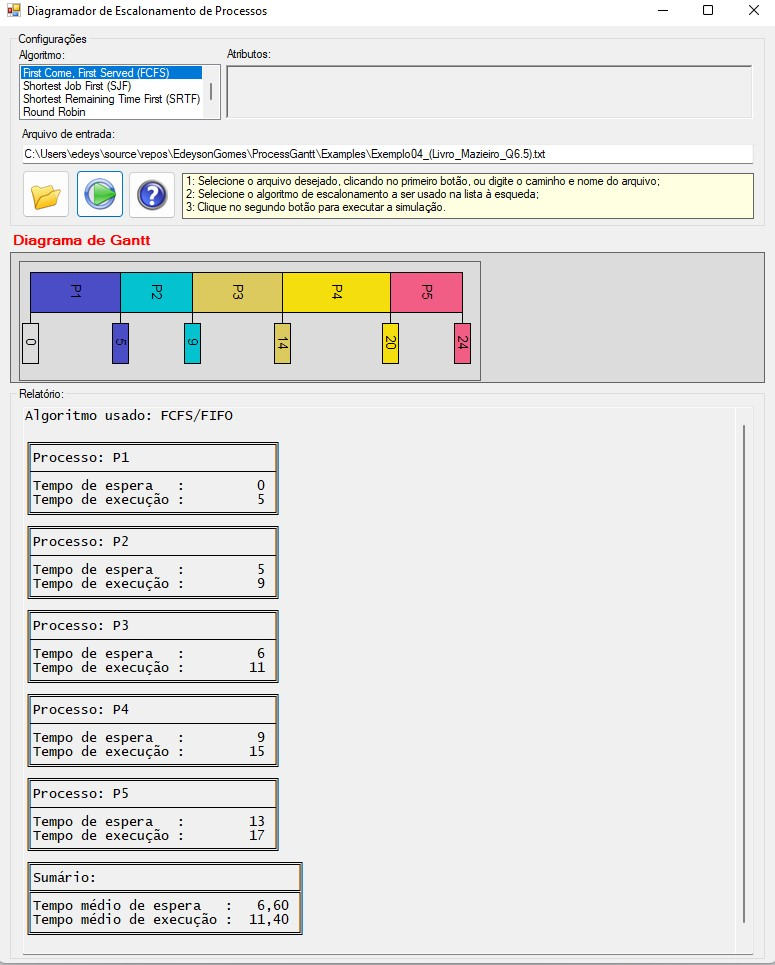
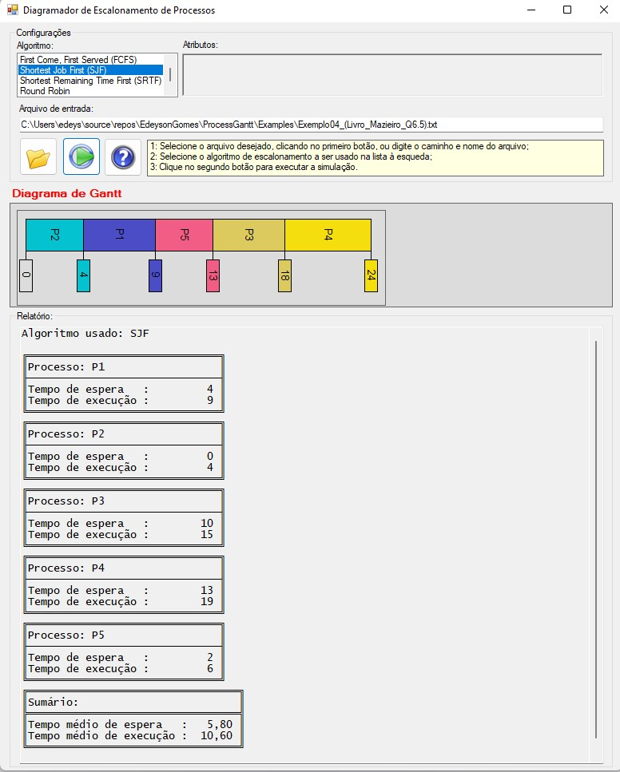
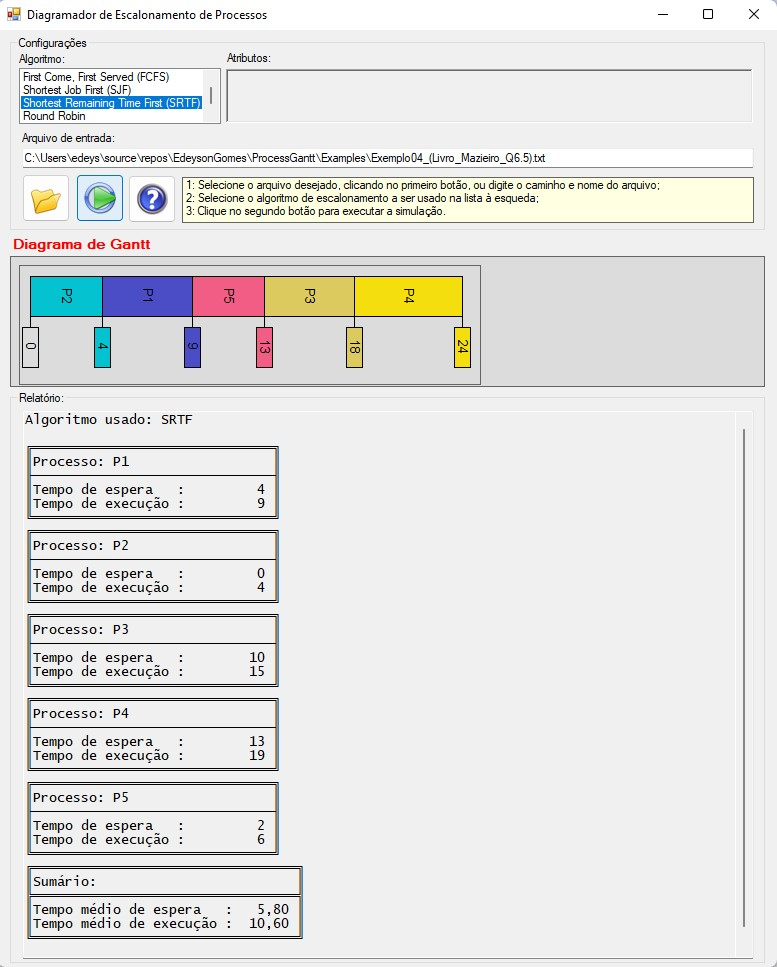
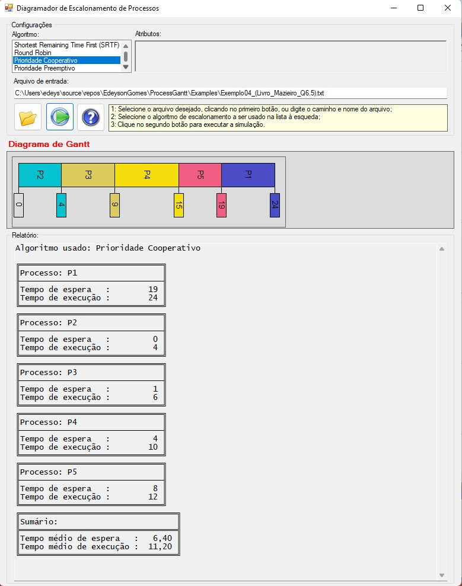
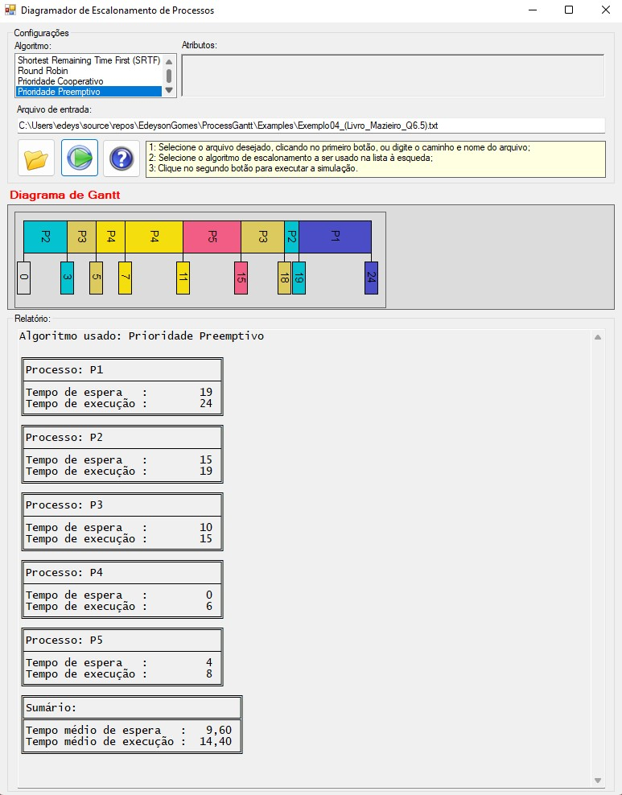
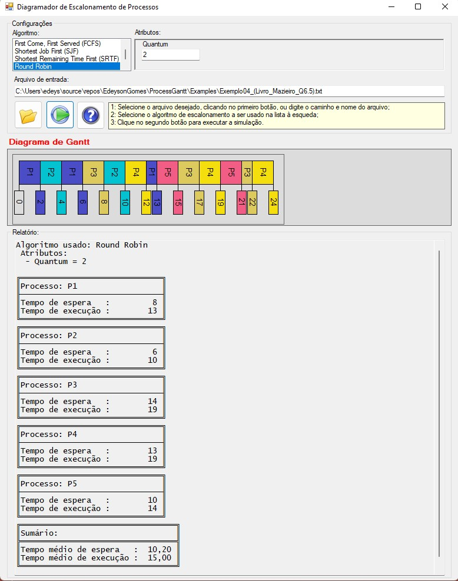
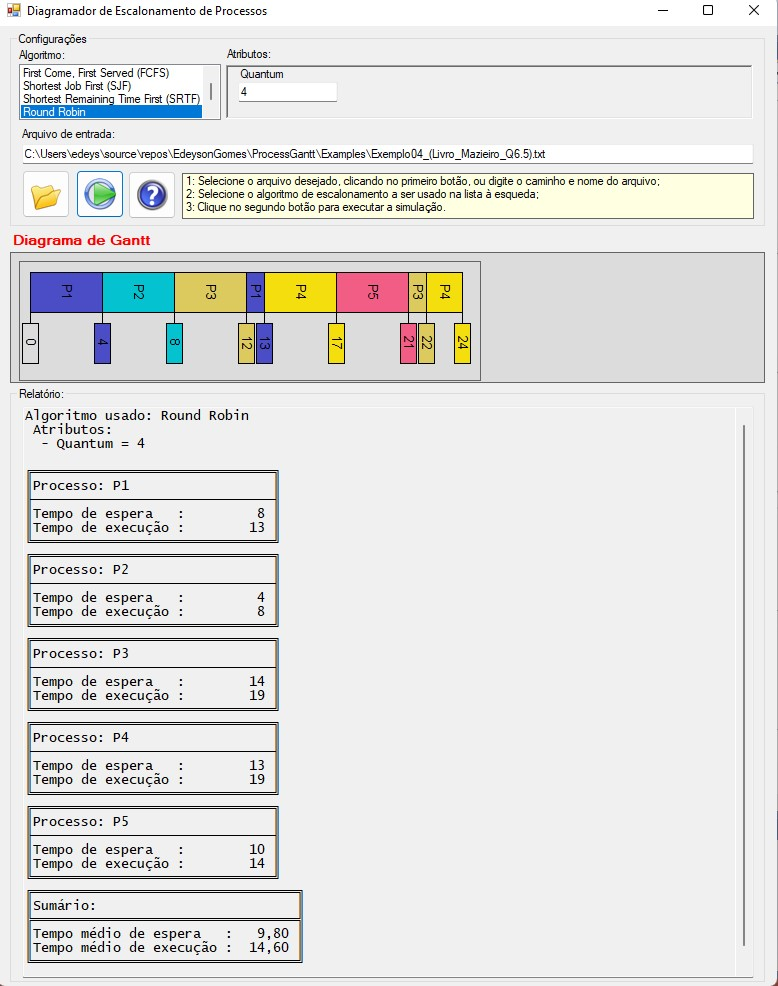
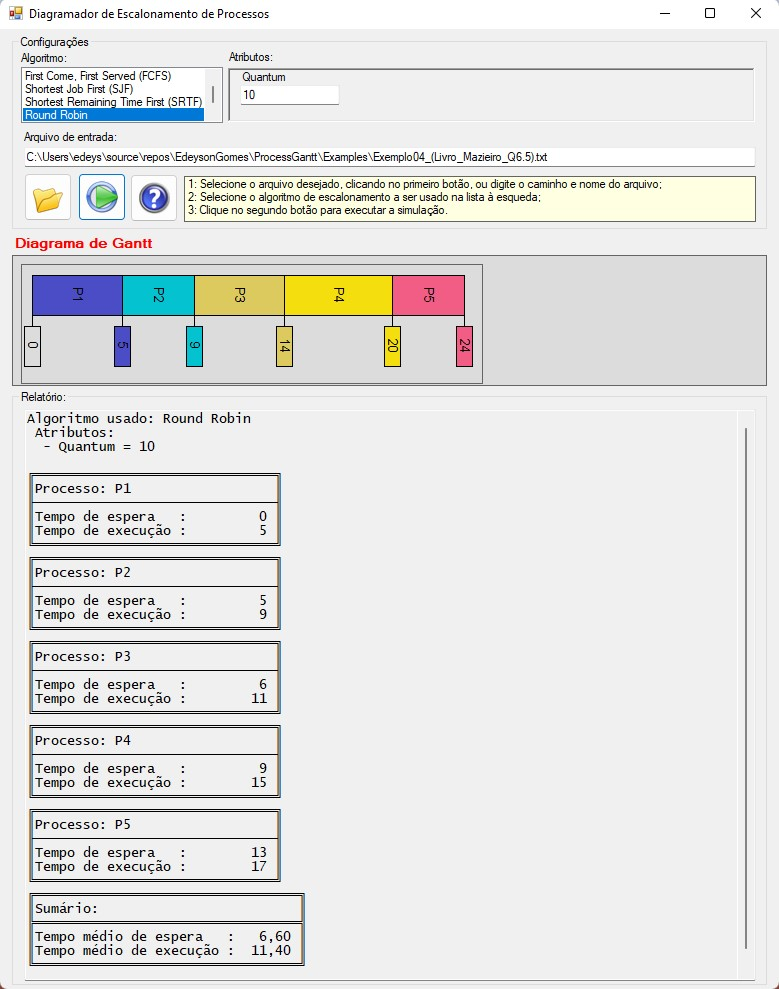

# ProcessGantt 

## Usage Example

To illustrate the **Process Scheduling Diagrammer**, we selected one of the exercises from Chapter 6 of the referenced book [2], described below:

**Question 5)** The following table represents a set of tasks ready to use a processor:

|Task       | t1 | t2 | t3 | t4 | t5 |
|-----------|----|----|----|----|----|
|Arrival    | 0  | 0  | 3  | 5  | 7  |
|Duration   | 5  | 4  | 5  | 6  | 4  |
|Priority   | 2  | 3  | 5  | 9  | 6  |

Graphically represent the task execution sequence (processes) and calculate the average turnaround time and waiting time for the following scheduling policies:

    (a) Cooperative FCFS
    (b) Cooperative SJF
    (c) Preemptive SJF (SRTF)
    (d) Cooperative Priority
    (e) Preemptive Priority
    (f) Round Robin with Quanta = 2, 4, and 10, without aging

**Considerations:**
1. All tasks are CPU-bound.  
2. Context switch times are zero.  
3. In case of ties (arrival time, priority, duration, etc.), the task **ti** with the smallest **i** prevails.  
4. Higher priority values indicate higher priority.  
5. Quanta 2 and 10 were added to item (f).

---

# Configuration File (.INI)

The INI file corresponding to the processes described in the table is available at [Mazieiro Book Q6.5](Examples/Exemplo04_(Livro_Mazieiro_Q6.5).txt).

The first step in using the Scheduler is to "Select the input file," as shown in Figure 1. It should be a text file containing the structure (INI) described in the Readme.md file.

The second step is to choose the scheduling algorithm and then execute the scheduler. If the Round Robin algorithm is selected, the quantum size must be specified as an attribute. The result includes the Gantt chart for process scheduling, waiting times, turnaround times, and their averages.

---

### Cooperative FCFS

### Cooperative SJF

### Preemptive SJF (SRTF)

### Cooperative Priority

### Preemptive Priority

### Round Robin with Quantum = 2, without aging

### Round Robin with Quantum = 4, without aging

### Round Robin with Quantum = 10, without aging

---

# References

1. Tanenbaum, A. S. (2015). Modern operating systems. Fourth edition. Boston: Pearson.  
2. Maziero, C. A. (2019). Sistemas operacionais: conceitos e mecanismos. Curitiba: DINF - UFPR, 2019.
